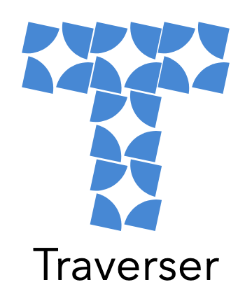

<p align="center">
 
[](https://app.circleci.com/pipelines/github/intuit/Traverser)
[](https://spectrum.chat/traverser)
[](https://maven-badges.herokuapp.com/maven-central/com.intuit.commons/traverser/) 
</p>
<hr />


 
# Traverser: java library to walk object graph

<!-- add badges -->

[Traverser][Traverser] solves a one of the most common tasks to operate on tree or graph data structure: 

- enumerate tree or graph nodes into a traverse sequence
- execute client actions on each enumerated node 
- fine grained control of the traversal loop (continue, break, skip nodes)

It exposes rich and fine level of capabilities like:
- iterators 
- both depth- and breadth- first search (DFS/BFS)
- pre- and post- order actions
- cycle detection
- visitors
- global and local node contexts

It helps in several areas:
- speed up implementation by re-using generic  solution (stable, tested, well-performant solution)
- reduce codebase
- expand and adjust use cases with simple changes
- decouples traversing routine from data structure and client actions, which boosts maintenability

## Getting Started

Add dependency on this module and traverse any complex data structure.
Gradle: 
```
 compile 'com.intuit.commons:traverser:1.0.0'
```
Maven:
```
<dependency>
    <groupId>com.intuit.commons</groupId>
    <artifactId>traverser</artifactId>
    <version>1.0.0</version>
    <type>pom</type>
</dependency>
```

## Local Development

```
./gradlew build
```

## Configuration

It is possible to override `version` and `group` of the artifact:
```
./gradlew clean -Pproject.version=1.0.0-SNAPSHOT -Pproject.group=com.intuit.commons  publishToMavenLocal
```
where `project.version` and `project.group` are used to control desired group and version. 
Artifact name is configured with `rootProject.name` property in *settings.gradle*.

## Learn by example 

Representing hierarchy of a medium-sized company is good example to illustrate key features of the traverser.  
```
Company 
    Bussiness Entity
          Teams
                Members
```

Snapshot of a virtual company staff:

```
Company
     BU-Pacific  
         Product Development
              Sylvester Moonstone
              John Smith
              Lucy Gold
         Sales Department
              Nick Citrine 
              Kleo Ruby 
         Management
              Anna Peridot                  
```

_Disclaimer: Names, characters and businesses are used in fictitious manner. Any resemblance to actual persons, living or dead is purely coincidental._

This company structure could be represented in Java as a set of classes that implement interface `Node`

#### Object structure

```java
import java.util.Collections;
import java.util.List;
import java.util.ArrayList;

/**
 * Defines the mimimalistic API to allow to form
 * Company structure tree
*/
public interface Node {
   /**
    * Name of a node
    */
   String getName ();
   /**
    * If Node is a leaf, returns an empty list
    * Otherwise returns the list of immediate chidren of the current
    * node.
    * This method is crucial to navigate the tree
    */
   List<Node> getChildren();
   /**
    * Visitor pattern support for Nodes 
    * to demonstrate double-dispatch mechanizm
    *
    * @see <a href="https://en.wikipedia.org/wiki/Visitor_Pattern">Visitor Pattern</a>
    * @see <a href="https://en.wikipedia.org/wiki/Double_dispatch">Double-Dispatch</a>
    */
   <U> U accept (U data, NodeVisitor<U> visitor);
}

/**
 * Visitor interface allows to decouple code that needs to be invoked
 * on Node instances from the various ways to enumerate Nodes in the tree
 *
 * Visitor pattern goes hand-in-hand with Double Dispatch pattern that 
 * allows to call Node-specific Visitor's method in a type safe manner, without need
 * to determine the type of Node. Node type is determined automatically when 
 * {@link Node.accept(U, NodeVisitor<U>) Node.accept} method is called.
 * Each Node implementation knows its own type and delegates the call to the corresponding
 * Visitor's method. 
 */
public interface NodeVisitor<U> {
   /**
    * Called when accepting Node is Company
    */
   U visitCompany (Company company, U data);
   /**
    * Called when accepting Node is BusinessEntity
    */
   U visitBusinessEntity (BusinessEntity businessEntity, U data);
   /**
    * Called when accepting Node is Team
    */
   U visitTeam (Team team, U data);
   /**
    * Called when accepting Node is Member
    */
   U visitMember (Member member, U data);
}

public class Company implements Node {
   String name;
   List<BusinessEntity> businessEntities = new ArrayList<>();
  
   public Company (String name) {
      this.name = name;
   }

   public Company businessEntity (BusinessEntity businessEntity) {
      businessEntities.add(businessEntity);
      return this;
   }

   public List<BusinessEntity> getBusinessEntities () {
      return businessEntities;
   }

   public String getName () {
      return name;
   }

   public List<Node> getChildren () {
      return (List<? extends Node>)getBusinessEntities();
   }

   public <U> U accept (U data, NodeVisitor<U> visitor) {
      // double-dispatch to the custom method for Company nodes 
      return visitor.visitCompany(this, data);
   }
}

public class BusinessEntity implements Node {
   String name;
   List<Team> teams = new ArrayList<>();

   public BusinessEntity (String name) {
      this.name = name;
   }

   public BusinessEntity team (Team team) {
      teams.add(team);
      return this;
   }

   public List<Team> getTeams () {
      return teams;
   }

   public String getName () {
      return name;
   }

   public List<Node> getChildren () {
      return (List<? extends Node>)getTeams();
   }

   public <U> U accept (U data, NodeVisitor<U> visitor) {
      // double-dispatch to the custom method for BusinessEntity nodes 
      return visitor.visitBusinessEntity(this, data);
   }
}

public class Team implements Node {
   String name;
   List<Member> members = new ArrayList<>();
 
   public Team (String name) {
      this.name = name;
   }

   public Team member (Member member) {
      members.add(member);
      return this;
   }

   public List<Member> getMembers () {
      return members;
   }

   public String getName () {
      return name;
   }

   public List<Node> getChildren () {
      return (List<? extends Node>)getMembers();
   }

   public <U> U visitTeam (U data, NodeVisitor<U> visitor) {
      // double-dispatch to the custom method for Team nodes 
      return visitor.visitTeam(this, data);
   }
}

public class Member implements Node {
   String name;

   public Member (String name) {
      this.name = name;
   }

   public String getName () {
      return name;
   }

   public List<Node> getChildren () {
      return Collections.emptyList();
   }

   public <U> U accept (U data, NodeVisitor<U> visitor) {
      // double-dispatch to the custom method for Member nodes 
      return visitor.visitMember(this, data);
   }
}
```

The same company structure could be represented in Scala as a set of classes that implement interface `Node` as below
```scala
import java.util

sealed trait Node {
  def getName: String

  def getChildren: java.util.ArrayList[Node]

  def accept[U](data: U, visitor: NodeVisitor[U]): U
}

sealed trait NodeVisitor[U] {
  def visitCompany(company: Company, data: U): U

  def visitBusinessEntity(businessEntity: BusinessEntity, data: U): U

  def visitTeam(team: Team, data: U): U

  def visitMember(member: Member, data: U): U
}

class Company(name: String) extends Node {
  val businessEntities = new util.ArrayList[BusinessEntity]

  def apply(name: String): Company = new Company(name)

  def businessEntity(businessEntity: BusinessEntity): Company = {
    businessEntities.add(businessEntity)
    this
  }

  def getName: String = name

  def getBusinessEntities: util.ArrayList[BusinessEntity] = businessEntities

  def getChildren: java.util.ArrayList[Node] = getBusinessEntities.asInstanceOf[java.util.ArrayList[Node]]

  def accept[U](data: U, visitor: NodeVisitor[U]): U = { // double-dispatch to the custom method for Company nodes
    visitor.visitCompany(this, data)
  }
}


class BusinessEntity(name: String) extends Node {
  val teams = new util.ArrayList[Team]

  def team(team: Team): BusinessEntity = {
    teams.add(team)
    this
  }

  def getTeams: util.ArrayList[Team] = teams

  def getName: String = name

  def getChildren: java.util.ArrayList[Node] = getTeams.asInstanceOf[java.util.ArrayList[Node]]

  def accept[U](data: U, visitor: NodeVisitor[U]): U = { // double-dispatch to the custom method for BusinessEntity nodes
    visitor.visitBusinessEntity(this, data)
  }
}

class Team(name: String) extends Node {
  val members = new util.ArrayList[Member]

  def member(member: Member): Team = {
    members.add(member)
    this
  }

  def getMembers: util.ArrayList[Member] = members

  def getName: String = name

  def getChildren: java.util.ArrayList[Node] = getMembers.asInstanceOf[java.util.ArrayList[Node]]

  def visitTeam[U](data: U, visitor: NodeVisitor[U]): U = { // double-dispatch to the custom method for Team nodes
    visitor.visitTeam(this, data)
  }

  def accept[U](data: U, visitor: NodeVisitor[U]): U = ???
}

class Member(name: String) extends Node {
  def getName: String = name

  def getChildren: java.util.ArrayList[Node] = new util.ArrayList[Node]()

  def accept[U](data: U, visitor: NodeVisitor[U]): U = { // double-dispatch to the custom method for Member nodes
    visitor.visitMember(this, data)
  }
}
```

The same company structure could be represented in Kotlin
[Company Model](examples/src/main/kotlin/model.kt)

## Explore 

### Integration: children provider  
Tree or graph is a collection of connected nodes. Traversing a tree or graph is an enumeration of its nodes, 
i.e. iterating over the sequence of nodes and executing some actions for each node in that sequence. 
In order to advance to the next node(s) while pointing/acting on a certain node it is important to know how to discover
next nodes from the current one.

Usually the operation to discover descendants of a particular node is very specific to the data structure that models the tree.
For instance, if you consider traversing a directory tree, descendant objects would be files or directories in the current directory and 
discovery method would be based on `java.io.File` API. 

One of benefits of using generic traversing mechanism is to decouple actual traversing from data structure it is being operated on.
Regardless of the way data is organized, core algorithms does not change. But data, root element(s) as well as children of given parents 
must be be known to traverser in some way, so the algorithm can advance to the next element.  

Children provider is a *\<FUNCTION\>* that discovers children of a given parent element.
It could be passed as lamda-function or method reference or any other applicable means. 

In the simple form, children provider should expect a given node or parent object and output is a collection of child nodes.
```java
Function<T, Collection<T>>
```
Assuming the Company structure above, the simplest way to provide children is to use method reference (`Node::getChildren`):

```java
// create a Traverser for DFS traversal
 Traverser<Node, TraverseContext<Node>> traveser = Traverser.depthFirst(Node::getChildren);
```

In general case, children provider obtains a stream of [TraverseContext][TraverseContext] objects that wrap children of a given parent. 
This allows to customize the traversal sequence as well as to customize `TraverseContext` objects that go into that sequence. 
```java
BiFunction<Traverser<T, TraverseContext<T>, TraverseContext<T>, Stream<TraverseContext<T>>>>
```

```java
// create a Traverser for BFS traversal
Traverser<Node, TraverseContext<Node>> traverser = Traverser
    .breadthFirst((taverser, parent) -> parent.thisNode()   // the wrapped Node object
        .getChildren()
        .stream()
        .map(node -> traverser.newContext(parent, node))
        // for instance, you may set this variable(s) for each child context
        .map(context -> context.var(String.class, "Hello, world!"))   
);
```

### TraverseContext
[TraverseContext][TraverseContext] represents an environment around a node in the traversal sequence. It contains a reference to the tree or graph node, reference to the parent `TraverseContext`, both local and "inherited" variables and optionally calculation result. 

### Iterator

[Iterator][TraversingIterator] is build on top of graph/tree traversal and shares common API.
There are 2 flavors (go deep or go broad) of direction and 2 flavours (before or after) of invocation.
This yields 4 total possible combinations of how iteration can be performed. 

Iterators allow to traverse the underlying tree or graph in a simple loop as if they were iterating over a sequence of tree or graph nodes.
> `TraversingIterator` has method `path` to obtain node's path to the root node the traversing started from. 
It also can manipulate with the current `TraverseContext` via `replace` method.

#### Depth-First traversing   

For a given tree or graph node, depth-first traversal always follows children before considering siblings:

##### Perform an action, then move to next

Nodes are enumerated in the depth-first order 

```java
// populate the company according example at the top of this discussion
Company c = new Company("Company")
    .businessEntity(new BusinessEntity("BU-Pacific")
        .team(new Team("PD=Product Development")
            .member(new Member("Sylvester Moonstone"))
            .member(new Member("John Smith"))
            .member(new Member("Lucy Gold")))
        .team(new Team("SL=Sales Department")
            .member(new Member("Nick Citrine"))
            .member(new Member("Kleo Ruby")))
        .team(new Team("MG=Management")
            .member(new Member("Anna Peridot"))));

// create depth-first pre-order iterator
TraversingIterator<Company> i = Traverser
    .depthFirst(Node::getChildren)
    .preOrderIterator(c);

// print names of the nodes in DFS sequence
while (i.hasNext()) {
    Node node = i.next();
    System.out.println(node.getName());
}
```

Output:
```
Company
BU-Pacific
PD=Product Development
Sylvester Moonstone
John Smith
Lucy Gold
SL=Sales Department
Nick Citrine
Kleo Ruby
MG=Management
Anna Peridot
```

Nodes are enumerated in the depth-first order in Scala as

```scala
// populate the company according example at the top of this discussion
val company = new Company("Company")
  .businessEntity(new BusinessEntity("BU-Pacific")
    .team(new Team("PD=Product Development")
      .member(new Member("Sylvester Moonstone"))
      .member(new Member("John Smith"))
      .member(new Member("Lucy Gold")))
    .team(new Team("SL=Sales Department")
      .member(new Member("Nick Citrine"))
      .member(new Member("Kleo Ruby")))
    .team(new Team("MG=Management")
      .member(new Member("Anna Peridot"))));

// create depth-first pre-order iterator// create depth-first pre-order iterator
val iter = Traverser.depthFirst((_:Node).getChildren).preOrderIterator(company)

// print names of the nodes in DFS sequence
while(iter.hasNext()) {
  val node = iter.next()
  println(node.getName)
}
```

Output:
```
Company
BU-Pacific
PD=Product Development
Sylvester Moonstone
John Smith
Lucy Gold
SL=Sales Department
Nick Citrine
Kleo Ruby
MG=Management
Anna Peridot
```

Nodes are enumerated in the depth-first order in Kotlin as

```kotlin
import com.intuit.commons.traverser.Traverser
import com.intuit.commons.traverser.TraversingIterator

fun main() {
    // populate the company according example at the top of this discussion
    val c = Company("Company")
            .businessEntity(BusinessEntity("BU-Pacific")
                    .team(Team("PD=Product Development")
                            .member(Member("Sylvester Moonstone"))
                            .member(Member("John Smith"))
                            .member(Member("Lucy Gold")))
                    .team(Team("SL=Sales Department")
                            .member(Member("Nick Citrine"))
                            .member(Member("Kleo Ruby")))
                    .team(Team("MG=Management")
                            .member(Member("Anna Peridot"))))

    // create depth-first pre-order iterator
    val i: TraversingIterator<Node> = Traverser
            .depthFirst<Node>(Node::children)
            .preOrderIterator(c)

    // print names of the nodes in DFS sequence
    while (i.hasNext()) {
        val node: Node = i.next()
        println(node.name)
    }
}
```

Full version of source code [depth-first.kt](examples/src/test/kotlin/depth-first.kt)

Output:
```
Company
BU-Pacific
PD=Product Development
Sylvester Moonstone
John Smith
Lucy Gold
SL=Sales Department
Nick Citrine
Kleo Ruby
MG=Management
Anna Peridot
```

##### Move to next, then perform an action:

Nodes are enumerated in the depth-first reverse order 

```java
// populate the company according example at the top of this discussion
Company c = ...

// create depth-first post-order iterator
TraversingIterator<Company> i = Traverser
    .depthFirst(Node::getChildren)
    .postOrderIterator(c);

// print names of the nodes in DFS sequence
while (i.hasNext()) {
...
}
``` 

Output:
```
Sylvester Moonstone
John Smith
Lucy Gold
PD=Product Development
Nick Citrine
Kleo Ruby
SL=Sales Department
Anna Peridot
MG=Management
BU-Pacific
Company
```

Nodes are enumerated in the depth-first reverse order in Scala as

```scala
// populate the company according example at the top of this discussion
val company = new Company("Company")
  .businessEntity(new BusinessEntity("BU-Pacific")
    .team(new Team("PD=Product Development")
      .member(new Member("Sylvester Moonstone"))
      .member(new Member("John Smith"))
      .member(new Member("Lucy Gold")))
    .team(new Team("SL=Sales Department")
      .member(new Member("Nick Citrine"))
      .member(new Member("Kleo Ruby")))
    .team(new Team("MG=Management")
      .member(new Member("Anna Peridot"))));

// create depth-first pre-order iterator// create depth-first pre-order iterator
val iter = Traverser.depthFirst((_:Node).getChildren).postOrderIterator(company)

// print names of the nodes in DFS sequence
while(iter.hasNext()) {
  val node = iter.next()
  println(node.getName)
}
```

Output:
```
Sylvester Moonstone
John Smith
Lucy Gold
PD=Product Development
Nick Citrine
Kleo Ruby
SL=Sales Department
Anna Peridot
MG=Management
BU-Pacific
Company
```

Nodes are enumerated in the depth-first reverse order in Kotlin as
```kotlin
fun main() {
    // populate the company according example at the top of this discussion
    val c = ...

    // create depth-first post-order iterator
    val i: TraversingIterator<Node> = Traverser
            .depthFirst(Node::children)
            .postOrderIterator(c)

    // print names of the nodes in DFS sequence
    while (i.hasNext()) {
        ...
    }
}
```

Full version of source code [depth-first-reverse.kt](examples/src/test/kotlin/depth-first-reverse.kt)

#### Breadth-First traversing

For a given tree or graph node, breadth-first always follows siblings, before it considers children.

##### Perform an action, then move to next:

Nodes are enumerated in the breadth-first order

```java
// populate the company according example at the top of this discussion
Company c = ...

// create breadth-first pre-order iterator
TraversingIterator<Company> i = Traverser
    .breadthFirst(Node::getChildren)
    .preOrderIterator(c);

// print names of the nodes in BFS sequence
while (i.hasNext()) {
    ...
}
``` 
Output:
```
Company
BU-Pacific
PD=Product Development
SL=Sales Department
MG=Management
Sylvester Moonstone
John Smith
Lucy Gold
Nick Citrine
Kleo Ruby
Anna Peridot
```
Nodes are enumerated in the breadth-first order in Scala as

```scala
// populate the company according example at the top of this discussion
val company = ...

// create breadth-first pre-order iterator
val iter = Traverser.breadthFirst((_:Node).getChildren).preOrderIterator(company)

// print names of the nodes in BFS sequence
while (iter.hasNext()) {
    ...
}
``` 
Output:
```
Company
BU-Pacific
PD=Product Development
SL=Sales Department
MG=Management
Sylvester Moonstone
John Smith
Lucy Gold
Nick Citrine
Kleo Ruby
Anna Peridot
```

Nodes are enumerated in the breadth-first order in Kotlin as

```kotlin
fun main() {
    // populate the company according example at the top of this discussion
    val c = ...

    // create breadth-first pre-order iterator
    val i: TraversingIterator<Node> = Traverser
            .breadthFirst(Node::children)
            .preOrderIterator(c)

    // print names of the nodes in DFS sequence
    while (i.hasNext()) {
        ...
    }
}
```
Full version of source code [breadth-first.kt](examples/src/test/kotlin/breadth-first.kt)

##### Move to next, then perform an action:

Nodes are enumerated in breadth-first opposite order (same as breadth-first order)

```java
// populate the company according example at the top of this discussion
Company c = ...

// create breadth-first post-order iterator
TraversingIterator<Company> i = Traverser
    .breadthFirst(Node::getChildren)
    .postOrderIterator(c);

// print names of the nodes in BFS sequence
while (i.hasNext()) {
...
}
``` 
Output
```
Company
BU-Pacific
PD=Product Development
SL=Sales Department
MG=Management
Sylvester Moonstone
John Smith
Lucy Gold
Nick Citrine
Kleo Ruby
Anna Peridot
```
Nodes are enumerated in breadth-first opposite order (same as breadth-first order) in Scala as

```scala
// populate the company according example at the top of this discussion
val company = ...

// create breadth-first post-order iterator
val iter = Traverser.breadthFirst((_:Node).getChildren).postOrderIterator(company)

// print names of the nodes in BFS sequence
while (i.hasNext()) {
...
}
``` 
Output
```
Company
BU-Pacific
PD=Product Development
SL=Sales Department
MG=Management
Sylvester Moonstone
John Smith
Lucy Gold
Nick Citrine
Kleo Ruby
Anna Peridot
```

Nodes are enumerated in breadth-first opposite order (same as breadth-first order) in Kotlin as

```kotlin
fun main() {
    // populate the company according example at the top of this discussion
    val c = ...

    // create breadth-first pre-order iterator
    val i: TraversingIterator<Node> = Traverser
            .breadthFirst(Node::children)
            .postOrderIterator(c)

    // print names of the nodes in DFS sequence
    while (i.hasNext()) {
        ...
    }
}
``` 
Full version of source code [breadth-first-opposite.kt](examples/src/test/kotlin/breadth-first-opposite.kt)


### Traversal loop control

At the core, Traverser enumerates nodes in the internal traversal loop.       
Traveser uses [visitors](https://en.wikipedia.org/wiki/Visitor_pattern) to take actions for each enumerated node.
Results of visitor's actions control traverser internal loop.

* `CONTINUE`
  
  discover children of the current node and continue the loop
    
* `SKIP`

  skip children of the current node, but continue the loop
  
* `QUIT`

  quit (break) the loop

Visitor's actions are methods of [TraverseVisitor][TraverseVisitor] interface called by [Traverser][Traverser] at the specific moments during traversal.
When a Traverser is about to process a node the very first time, it calls `enter` method, which is a **pre-order** action.
If the result is `CONTINUE`, Traverser discovers children of the current node, so they could be processed too.
After all children of the current node have been processed, `Traverser` calls `leave` method to execute a **post-order** action.
If a node has been already processed, Traverser calls `onBackRef` method to execute an action on a **cyclicly** referenced node.
In order to avoid infinite recursion loop, Traverser does not discover children of such node, similar to the effect of `SKIP` action result.

#### Execute both pre- and post- order actions
```java
// populate the company according example at the top of this discussion
Company c = ...;

// create depth-first traverser and execute it
boolean foundKleoRuby = Traverser
    .depthFirst(Node::getChildren)
    .traverse(c, false, new TraverseVisitor<Node, TraverseContext<Node>>() {
       public Traverser.Action enter (TraverseContext<Node> context) {
            Node node = context.thisNode();
            System.out.println("enter: " + node.getName());
            if (node.getName().equals("Kleo Ruby")) {
                context.setResult(true);
                // request to abort the loop
                System.out.println("Found. Quitting.");
                return Traverser.Action.QUIT;
            } else {
                // allow advancing to the children of this node if any
                return Traverser.Action.CONTINUE;
            }
       }
       public Traverser.Action leave (TraverseContext<Node> context) {
            Node node = context.thisNode();
            System.out.println("leave: " + node.getName());
            // in post-process CONTINUE and SKIP are treated equally
            // to allow advancing to the next discovered nodes, but
            // do not discover children of this node anymore
            return Traverser.Action.CONTINUE;
       }
       public Traverser.Action onBackRef (TraverseContext<Node> context) {
            Node node = context.thisNode();
            System.out.println("onBackRef: " + node.getName() + ". What happened?");
            return Traverser.Action.CONTINUE;
       }
    });
System.out.println("foundKleoRuby: " + foundKleoRuby);
```
Output
```
enter: Company
enter: BU-Pacific
enter: PD=Product Development
enter: Sylvester Moonstone
leave: Sylvester Moonstone
enter: John Smith
leave: John Smith
enter: Lucy Gold
leave: Lucy Gold
leave: PD=Product Development
enter: SL=Sales Department
enter: Nick Citrine
leave: Nick Citrine
enter: Kleo Ruby
Found. Quitting.
foundKleoRuby: true
```

Look here for [Groovy Examples](.github/Groovy.md).

Similar Kotlin example [depth-first-execute.kt](examples/src/test/kotlin/depth-first-execute.kt)

## Technologies Used

Minimum required: Java 8

This library depends on Apache `commons-collections` and `slf4j`. 

## Contributing Guidelines

Welcome contributors!
 [CONTRIBUTING.md](.github/CONTRIBUTING.md).

## Support

About [opensource](https://opensource.intuit.com) at Intuit.

## Legal 

Read more about license for this software [License](LICENSE).

[Traverser]: src/main/java/com/intuit/commons/traverser/Traverser.java
[TraverseContext]: src/main/java/com/intuit/commons/traverser/TraverseContext.java
[TraversingIterator]: src/main/java/com/intuit/commons/traverser/TraversingIterator.java
[TraverseVisitor]: src/main/java/com/intuit/commons/traverser/TraverseVisitor.java
